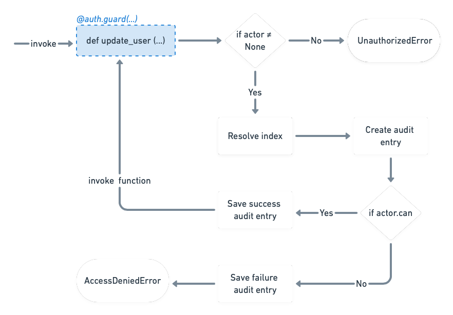

# Targe
Powerful and flexible policy based authorization library.


## Installation

With pip:
```
pip install targe
```

or with poetry

```
poetry add targe
```

## Quick start

```python
from targe import Auth, ActorProvider, Actor, Policy
from targe.errors import AccessDeniedError


# This will provide actor for auth mechanism
class MyActorProvider(ActorProvider):
    def get_actor(self, actor_id: str) -> Actor:
        return Actor(actor_id)


# Initialise auth class
auth = Auth(MyActorProvider())

# Retrieves and authorizes actor by its id
auth.authorize("actor_id")


# `auth.guard` decorator assigns auth scope to a function and
# protects it from non-authorized access
@auth.guard(scope="protected")
def protect_this() -> None:
    ...  # code that should be protected by auth


try:
    protect_this()
except AccessDeniedError:
    ...  # this will fail as actor has no access to scope `protected`

auth.actor.policies.append(Policy.allow("protected"))  # add `protected` scope to actor policies
protect_this()  # now this works
```

## Features

### Customisable and flexible policy system
Policy system in targe is not limited to some keywords like `read`, `write`, `create`, etc. 
Instead it uses scopes, which can hold any value that makes sense in your application's domain 
like `eat:salads`. To increase flexibility and control `targe` also allows for defining references
that can point to certain data in your application.

### Minimal, close to 0 learning curve
If you already have some experience with other `acl` or `authorization` libraries there is 
almost 0 learning curve. In order to start using the library you only need to learn 5 methods:
- `Auth.guard`
- `Auth.guard_after`
- `Policy.allow`
- `Policy.deny`
- `ActorProvider.get_actor`

### Built-in audit log
Everytime guarded function is executed library creates a log entry. This log entries can be persisted
and used later on to understand who, when, how and what has changed within your application.

### Elegant and easy to use interface
You don't have to write complex `if` statements asserting whether user has given role, policy. 
All of that happens automatically in one small `@guard` decorator, which can be attached to 
any function/method within your codebase and easily moved away if needed. 

# Usage

## Execution flow

The following diagram is a high level representation of the execution flow.



When function gets called, instance of `Auth` class is checking whether `actor` is accessible 
(this should happen when `Auth.init` is called). 
If `actor` is not accessible because `Auth.init` was not called or because `AuthStore.get_user` returned `null` value, 
`UnauthorizedError` exception is raised. 

When `actor` is present, library will try to resolve `reference` (reference contains a value that points to a piece 
of information stored in your application), reference resolving will occur if expression passed in `ref` attribute 
in the `guard` decorator.

Everytime function is being called, library automatically generates audit log, which later on might be used to 
understand how, by who and whether guarded data in your system has being changed and/or accessed. 

The last step is execution of guarded function.

## Actor
Actor represents or references to a user in your application. Other important characteristics are:
- an actor aggregates permissions and roles
- an actor encapsulates its state and may act upon its change  
- actor knows whether is can access given scope
- actor's id is referenced in audit log  
- actor can be extended further to encapsulate your application logic 

### Instantiating actor

```python
from targe import Actor

my_actor = Actor("actor_id")
```

### Assigning policies

```python
from targe import Actor, Policy

my_actor = Actor("actor_id")

# assign policies 
my_actor.policies.append(Policy.allow("articles:update"))
```

### Assigning roles

```python
from targe import Actor, Policy, Role

my_actor = Actor("actor_id")

# simple role
user_manager = Role("user_manager")
user_manager.policies.append(Policy.allow("user:*"))

# assign role
my_actor.roles.append(user_manager)
```

### Providing actor to auth system
By default, auth system does not know who is your actor and what it can do. 
To provide information about your actor, you have to implement `targe.ActorProvider` protocol, 
please consider the following example:

```python
from targe import ActorProvider, Actor, Auth


class MyActorProvider(ActorProvider):
    def get_actor(self, actor_id: str) -> Actor:
        ...  # you can query your database or do other relevant task to factory your instance of `targe.Actor`
        return Actor(actor_id)


# now we have to just instantiate auth and pass instance of our ActorProvider implementation
auth = Auth(MyActorProvider())

# The following line will cause auth system to use `MyActorProvider.get_actor` method.
auth.authorize("actor_id")
```

## Policies

Policy is an object representing logical rule describing how and what type of information
can be accessed in your application. 
Once policies are created they can ba attached to a role, or a user to ensure fine-grained
access control.

Policies contain `scopes` and `references`. The first ones holds an information how data is 
being accessed within your application (`read`, `write`, `update`, `etc`), 
the latter ones define a rule that might limit accessibility to a single entity 
or entire group of entities. 

The following code snippet shows an example policy that might be used to allow user 
updating articles in specified category `animals`.

```python
from targe import Policy

policy = Policy.allow(scope="articles:update", ref="articles:animals:*")
```

Having policy above we could also specify an article with an id of `article_id` 
within `animals` category that should not be updated:

```python
from targe import Policy

policy = Policy.deny("articles:update", "articles:animals:article_id")
```

### Scopes

Scopes can be used to set logical boundaries in your application. These are the boundaries 
in which data is being accessed and/or manipulated. Scope names can contain `:` (namespace separator) 
to improve granularity e.g.: `article:meta:setKeywords`.

Defining policy per scope can be repetitive task, consider the following example:

```python
from targe import Policy

Policy.allow("article:meta:setKeywords")
Policy.allow("article:meta:setVersion")
Policy.allow("article:meta:setCategory")
Policy.allow("article:meta:getKeywords")
Policy.allow("article:meta:getVersion")
Policy.allow("article:meta:getCategory")
...
```

> Note: if no reference is provided by default everything is accessible within given scope.

In the scenarios like this, `targe` provides pattern matching mechanism, so the above can be simplified to:

```python
from targe import Policy

Policy.allow("article:meta:set*")
Policy.allow("article:meta:get*")
```

### References

References can be used to identify and/or logically group your data. References are using similar 
mechanism to scopes, which means in policies definition you can take advantage of `:` (namespace separator)
same way like you do it in the scope definition. 

You can define as many references as needed, as long as they do not collapse, e.g.:
Imagine you have two references expressions, first follows schema `users:{group}:{id}`, 
the other one `users:{group}:{sub-group}:{id}`. 

Let's have a look how pattern matching will work in this scenario:
```
users:{group}:{id}
               +
               |    When matching reference with pattern `users:group:*`, we can match both
               |    all users within all {sub-groups} and all users within a {group},
               |    so having these two references in our application can cause problems.
               +
users:{group}:{sub-group}:{id}
```

Defining additional namespace inside your reference can solve the problem, it may follow 
the schema `{resource_type}:{namespace}:{logical-group-n}:{logical-group-n+1}:{id}`:

```
users:by_group:{group}:{id}
        +
        |   Because we have additonal namespace element which is unique (`by_group` in the first case and `by_subgroup`
        |   in the second case), we can safely use both references together in our application.
        +
users:by_subgroup:{group}:{sub-group}:{id}
```

> It is recommended to have one schema reference per resource type unless 
> your schema grows large (has many namespace elements).

## Roles

Role is a collection of policies with a unique name. Roles can be also 
used to build Role-based access control (RBAC), which is a simplified mechanism
for regulating access to part of your application based on the roles 
of individual actor.

Here's an example Role that can be used to grand access to user management:

```python
from targe import Role, Policy

role = Role("user_manager")

# You can also attach policies, it is not needed if you are planning to build
# authorization system based on RBAC
role.policies.append(Policy.allow("user:create"))
role.policies.append(Policy.allow("user:update"))
role.policies.append(Policy.allow("user:delete"))
role.policies.append(Policy.allow("user:read"))
```

> Role names must follow [a-z][a-z0-9_-] pattern. Role name is also its identifier, 
> thus they should be unique across your application.

## Guarding function

Protecting function from unauthorized access is one of the main objectives of this library.
We can protect function in two styles:
- acl based style
- rbac style

Use rbac style in scenarios where you have to just assert if actor has given role, use acl based style in other cases.
ACL based style is not only giving you more control over your resources but also enables audit log. 

### Guarding function - rbac style example

To protect function from unauthorized execution use `Auth.guard(rbac=[...])` decorator with `rbac` argument. The `rbac`
argument accepts list of strings where each string is a role name that is required in to execute annotated function.

> If more than one role is passed in the `rbac` argument, this means actor has to own all the required roles
> to execute annotated function.

```python
from targe import ActorProvider, Actor, Auth
from targe.errors import AccessDeniedError

class MyActorProvider(ActorProvider):
    def get_actor(self, actor_id: str) -> Actor:
        return Actor(actor_id)
    
auth = Auth(MyActorProvider())

auth.authorize("actor_id")

@auth.guard(rbac=["user_manager"])  # Here we use `Auth.guard` decorator to protect `create_user` function
def create_user() -> None:
    ...

try:
    create_user()
except AccessDeniedError:
    print("`create_user` is protected from unauthorized access.")
```

> Keep in mind you can still take advantage of audit log in rbac mode, 
> the only requirement is to provide `scope` argument in `Auth.guard` decorator.

### Guarding function - acl style example

```python
from targe import ActorProvider, Actor, Auth
from targe.errors import AccessDeniedError

class MyActorProvider(ActorProvider):
    def get_actor(self, actor_id: str) -> Actor:
        return Actor(actor_id)
    
auth = Auth(MyActorProvider())

auth.authorize("actor_id")

@auth.guard(scope="user:create") 
def create_user() -> None:
    ...

try:
    create_user()
except AccessDeniedError:
    print("`create_user` is protected from unauthorized access.") 
```

#### Implementing custom behaviour

## Audit log

### Persisting audit log
