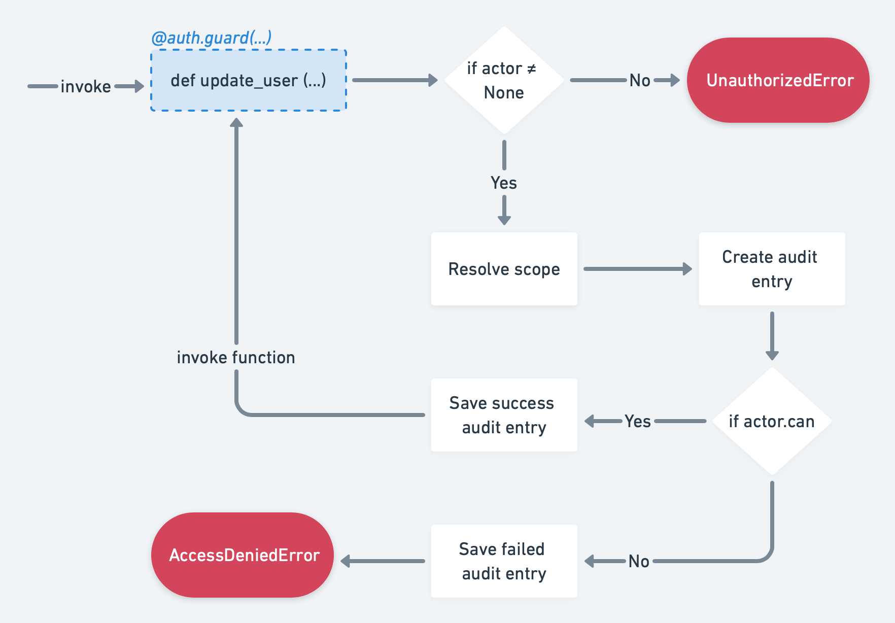

# Targe
A powerful and flexible authorization library utilizing a policy system that reflects your domain.


## Installation

With pip:
```
pip install targe
```

or with poetry

```
poetry add targe
```

## Quick start

```python
from targe import Auth, ActorProvider, Actor, Policy
from targe.errors import AccessDeniedError


# This will provide an actor for the auth mechanism
class MyActorProvider(ActorProvider):
    def get_actor(self, actor_id: str) -> Actor:
        return Actor(actor_id)


# Initialise auth class
auth = Auth(MyActorProvider())

# Retrieve and authorize actor by its id
auth.authorize("actor_id")


# `auth.guard` decorator assigns auth scope to a function and
# protects it from non-authorized access
@auth.guard(scope="protected")
def protect_this() -> None:
    ...  # code that should be protected by auth


try:
    protect_this()
except AccessDeniedError:
    ...  # this will fail as actor has no access to scope `protected`

auth.actor.policies.append(Policy.allow("protected"))  # add `protected` scope to actor policies
protect_this()  # now this works
```

## Features

### Customisable and flexible policy system
The policy system in **Targe** is not limited to specific keywords like `read`, `write`, `create`, etc. 
It uses scopes instead, scopes can hold any value that makes sense in your application's domain 
like `salads : eat`. To increase flexibility and control over your domain **Targe** allows you to define dynamic
scopes that can point to specific data in your application.

### Minimal, close to 0 learning curve
If you already have some experience with other `acl` or `authorization` libraries there is 
almost 0 learning curve. In order to start using the library you only need to learn these 5 methods:
- `Auth.guard`
- `Auth.guard_after`
- `Policy.allow`
- `Policy.deny`
- `ActorProvider.get_actor`

### Built-in audit log
Everytime a guarded function is executed, the library creates a log entry. These log entries can be persisted
and used later on to understand who, when, how and what has changed within your application.

### Elegant and easy to use interface
You don't have to write complex `if` statements asserting whether a user has a given role or policy. 
All of that happens automatically in one small `@guard` decorator, which can be attached to 
any function / method within your codebase, and easily removed if needed. 

# Usage

## Execution flow

The following diagram is a high level representation of the execution flow:




When a protected function gets called, the `targe.Auth` class checks whether the `actor` is accessible 
(`targe.Auth.init` is responsible for providing a valid instance of `targe.Actor`). 

If for some reason the `actor` is not accessible (`Auth.init` was not called, or `targe.ActorProvider` has failed), 
an `UnauthorizedError` exception is raised. 

When an `actor` is present, the library will attempt to resolve the `scope` and assert whether the `actor` has the required
policy or access to the given scope. Once this is done, the library will automatically generate an audit log 
which can be persisted to a database for future reference.

Finally, if actor has sufficient rights guarded function is executed, otherwise `targe.AccessDeniedError` is raised.

## Actor
An actor represents an authenticated user in your application. Other important characteristics of an actor are:
- An actor aggregates permissions and roles
- An actor encapsulates its state and may act upon its change  
- An actor knows whether is can access given scope
- An actor's id is referenced in audit log  
- An actor can be extended further to encapsulate your application logic 

### Creating a new actor

```python
from targe import Actor

my_actor = Actor("actor_id")
```

### Assigning policies

```python
from targe import Actor, Policy

my_actor = Actor("actor_id")

# assign policies 
my_actor.policies.append(Policy.allow("articles : update"))
```

> Note: whitespaces in scope are irrelevant, both `articles:update`, `articles : update`
> are equal from the library points of view.

### Assigning roles

```python
from targe import Actor, Policy, Role

my_actor = Actor("actor_id")

# simple role
user_manager = Role("user_manager")
user_manager.policies.append(Policy.allow("user:*"))

# assign role
my_actor.roles.append(user_manager)
```

### Providing an actor to the auth system
By default, the auth system does not know who is your actor and what it can do. 

To provide information about your actor, you have to implement the `targe.ActorProvider` protocol, 
please consider the following example:

```python
from targe import ActorProvider, Actor, Auth


class MyActorProvider(ActorProvider):
    def get_actor(self, actor_id: str) -> Actor:
        ...  # you can query your database or do other relevant task to factory your instance of `targe.Actor`
        return Actor(actor_id)


# now we have to just instantiate auth and pass an instance of our ActorProvider implementation
auth = Auth(MyActorProvider())

# The following line will cause the auth system to use `MyActorProvider.get_actor` method.
auth.authorize("actor_id")
```

## Policies

**Policy** is an object representing a logical rule that can either allow or deny accessing
certain areas of your application. 
Once policies are created they can ba attached to a role or a user, to ensure fine-grained
access control.

Policies contain `scopes` and `effect`. The first one holds information how data is 
being accessed within your application (`read`, `write`, `update`, `etc`), the latter 
tell whether the scope is accessible or not.

You can define a policy like in the example below:
```python
from targe import Policy

policy = Policy.allow(scope="articles : update")
```

### Scopes

Scope is a string representing a logical boundary within your application in which data is being 
accessed and/or manipulated. This string must follow the pattern [a-zA-Z][a-zA-Z0-9-_]*, whitespaces are ignored.
Characters like: `:`, `,`, `*` are allowed in the scope, but they have specific meaning:

- `:` to build namespaced scopes
- `,` to match multiple scope sections
- `*` for pattern matching expressions

Scopes can be used in policies and in guarded functions. Use scopes in policies to set rules for existing logical 
boundaries in our application. To define those boundaries, scopes must be provided in the `Auth.guard` decorator, which
decorates a given function or method.

The following is a list of valid policy scopes:
```
articles
articles : update
articles : update : article_id
articles : create, upate, delete
articles : *
articles : meta : set-*
articles : meta : *Name
articles : update : * : tags
```

#### Pattern matching

Let's review the following code snippet which defines multiple policies:

```python
from targe import Policy

Policy.allow("article : meta : setKeywords")
Policy.allow("article : meta : setVersion")
Policy.allow("article : meta : setCategory")
Policy.allow("article : meta : getKeywords")
Policy.allow("article : meta : getVersion")
Policy.allow("article : meta : getCategory")
```

It is quite a repetitive task which can be simplified by using pattern matching in the policy's scopes:

```python
from targe import Policy

Policy.allow("article : meta : set*")
Policy.allow("article : meta : get*")
```

An asterisk at the end of each scope tells **Targe** to use the pattern matching mechanism. 
The first policy might be interpreted as "match all the scopes which start with the `article` namespace, followed by the `meta` 
namespace, followed by a namespace that starts with `set`". The second scope is very similar but the last namespace 
has to start with `get` instead. 

Here are some examples to help you understand how pattern matching works:
```
article : *
```
Match all scopes that start with article namespace.
```
article : * : id
```
Match all scopes that start with an `article`, has `any` namespace after that and ends with a `id`.
```
article : *Name
```
Match all scopes that start with an `article` namespace and are followed by a namespace that ends with `Name`

Let's now go back to our last example that we simplified with pattern matching. We can simplify it  
even further with grouping. Let's consider the following code snippet:

```python
from targe import Policy

Policy.allow("article : meta : set*, get*")
```

Now with the above policy we can match all the scopes that were presented at the beginning of this chapter.

## Roles

Role is a collection of policies with a unique name. Roles can also be 
used to build Role-based access control (RBAC), which is a simplified mechanism
for regulating access to part of your application based on the roles of an individual actor.

The following is an example where the `user_manager` role is defined:

```python
from targe import Role, Policy

role = Role("user_manager")

# You can also attach policies to a role, but it is not needed in a RBAC scenario
role.policies.append(Policy.allow("user : create, update, delete, read"))
```

> Role names must follow the [a-z][a-z0-9_-]+ pattern. A role name is also its identifier, 
> thus they should be unique across your application.

## Guarding function

Protecting a function from unauthorized access is one of the **Targe**'s main objectives.

We can protect a function from unauthorized execution using two styles:
- ACL style
- RBAC style

Use the RBAC style in scenarios where you have to just assert if an actor has a given role, and use the ACL style in other cases.
The ACL style is not only giving you more control over your resources but also automatically enables the audit log. 

### Guarding function - RBAC style example

To protect a function from unauthorized execution use the `Auth.guard(rbac=[...])` decorator with `rbac` as the argument. The `rbac`
argument accepts a list of strings where each string is a role name that is required to execute annotated function.

> If more than one role is passed in the `rbac` argument, this means the actor has to own all of the required roles
> to execute the annotated function.

```python
from targe import ActorProvider, Actor, Auth
from targe.errors import AccessDeniedError


class MyActorProvider(ActorProvider):
    def get_actor(self, actor_id: str) -> Actor:
        return Actor(actor_id)


auth = Auth(MyActorProvider())

auth.authorize("actor_id")


@auth.guard(roles=["user_manager"])  # Here we use `Auth.guard` decorator to protect `create_user` function
def create_user() -> None:
    ...


try:
    create_user()
except AccessDeniedError:
    print("`create_user` is protected from unauthorized access.")
```

> Keep in mind you can still take advantage of audit logs in RBAC mode, 
> the only requirement is to provide a `scope` argument in the `Auth.guard` decorator.

### Guarding function - ACL style example

```python
from targe import ActorProvider, Actor, Auth
from targe.errors import AccessDeniedError

class MyActorProvider(ActorProvider):
    def get_actor(self, actor_id: str) -> Actor:
        return Actor(actor_id)
    
auth = Auth(MyActorProvider())

auth.authorize("actor_id")

@auth.guard(scope="user : create") 
def create_user() -> None:
    ...

try:
    create_user()
except AccessDeniedError:
    print("`create_user` is protected from unauthorized access.") 
```

#### Dynamic scopes

Sometimes you might run into scenarios where you would like to limit access to a given entity
or group of entities. In these scenarios, dynamic scopes may come in handy. 
Dynamic scopes contain placeholders for values held by arguments passed to a guarded function.
Everytime a function is called, placeholders are replaced with corresponding values.

```python
from targe import ActorProvider, Actor, Auth, Policy
from targe.errors import AccessDeniedError

class MyActorProvider(ActorProvider):
    def get_actor(self, actor_id: str) -> Actor:
        # lest initialize actor and allow access to `articles:update:allowed_id` scope.
        actor = Actor(actor_id)
        actor.policies.append(Policy.allow("articles:update:allowed_id"))
        
        return actor
    
auth = Auth(MyActorProvider())

auth.authorize("actor_id")

class Article:
    def __init__(self, article_id: str, body: str):
        self.article_id = article_id
        self.body = body

# Here we define a dynamic scope that holds reference to the function's parameter `article` 
# and tries to access its property `article_id`
@auth.guard(scope="article : update : { article.article_id }") 
def update_article(article: Article) -> None:
    print("article updated")

# the following attempt will fail as the actor has access only to the `article:update:allowed_id` scope
try:
    update_article(Article("other_id", "Lorem Ipsum"))
except AccessDeniedError:
    print("`update_article` is protected from unauthorized access.") 

# this line will succeed
update_article(Article("allowed_id", "Lorem Ipsum"))
```

### Overriding function guarding mechanism

You can override the default behavior of the guard mechanism in scenarios when it denies access to a guarded
function. In order to do that, pass a callable object to the `Auth` initializer, like below:

```python
from targe import ActorProvider, Actor, Auth

class MyActorProvider(ActorProvider):
    def get_actor(self, actor_id: str) -> Actor:
        return Actor(actor_id)
    
def on_guard(actor: Actor, scope: str) -> bool:
    if scope == "user:create":
        return True
    
    return False
    
auth = Auth(MyActorProvider(), on_guard=on_guard)
auth.authorize("actor_id")

@auth.guard(scope="user:create") 
def create_user() -> None:
    ...

create_user()
```

The callable object must return a `bool` value (`True` in order to allow access, `False` to deny access) and accept two parameters:
- `actor: targe.Actor` - an actor that is currently authorized in the system
- `scope: str` - the scope assigned to the guarded function


## Audit log

The audit log might be useful if you need to track an actor's activities in your application.
By default, all actor's actions against guarded functions are automatically recorded and stored
in memory as long as the `scope` attribute is provided in the `Auth.guard` decorator. 

> The `InMemoryAuditStore` class is a default in-memory implementation of the `AuditStore` protocol, which
> is instantiated by the `Auth` class if no other implementation is provided.


### AuditEntry structure

`targe.AuditEntry` is a representation of a single actor's action against a guarded function in your application.

Each audit entry contains the following information:
- **`entry_id`**: `str` - unique identifier 16 characters long
- **`actor_id`**: `str` - id of authenticated actor may reference to a user in your application
- **`scope`**: `str` - scope in which the function was executed, defined in guard decorator
- **`status`**: `targe.AuditStatus` - tells whether execution of a guarded function was successful or not
- **`created_on`**: `datetime.datetime` - the time that the action was initialized

### Persisting audit log

As we already discussed, by default the audit log is stored only in memory, this behaviour 
can be simply amended by implementing the `targe.AuditStore` protocol and passing an instance
of the new implementation into `targe.Auth`'s initializer:

```python
from targe import AuditStore, AuditEntry, Auth, ActorProvider, Actor
import sqlite3


class MyActorProvider(ActorProvider):
    def get_actor(self, actor_id: str) -> Actor:
        return Actor(actor_id)

    
class MyAuditStore(AuditStore):
    def __init__(self, connection: sqlite3.Connection):
        self.connection = connection
        
    def append(self, log: AuditEntry) -> None:
        query = self.connection.cursor()
        query.execute(
            "INSERT INTO audit_log VALUES(?, ?, ?, ?, ?)",
            (
                log.entry_id,
                log.actor_id,
                log.scope,
                log.status,
                log.created_on
             )
        )
        
db_connection = sqlite3.connect("audit_log.db")
auth = Auth(actor_provider=MyActorProvider(), audit_store=MyAuditStore(db_connection))
auth.authorize("actor_id")
...
```
